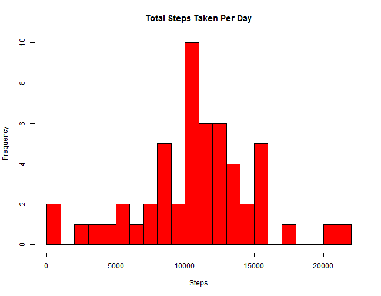
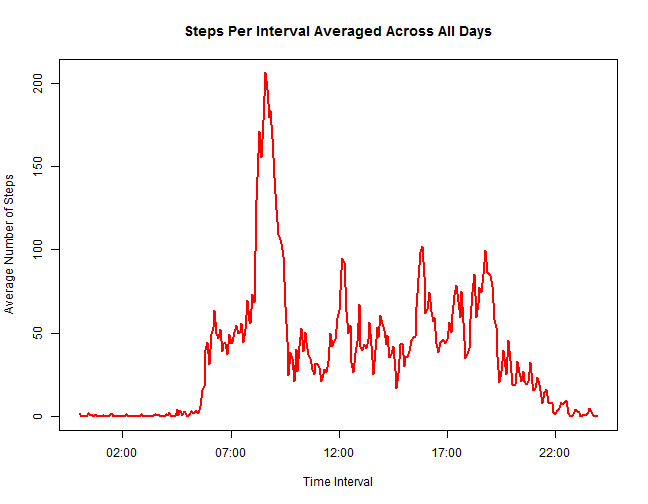
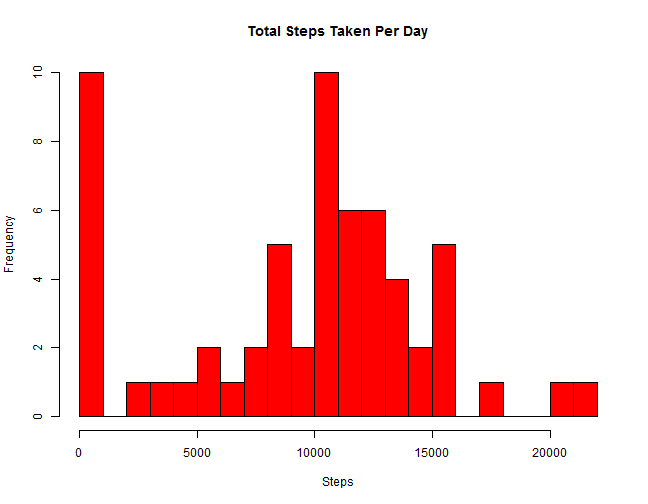
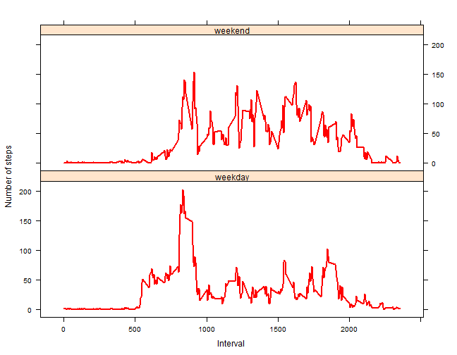

Reproducible Research: Peer Assessment Project 1
========================================================

## Downloading Data

The data was manually downloaded from https://d396qusza40orc.cloudfront.net/repdata%2Fdata%2Factivity.zip

## Loading and Preprocessing Data

### Loading File


```r
require(utils)

origData <- read.csv("activity.csv", na.string = "NA")
```

### Transforming Data 

The steps involved in the transformation are as follows:
- Create a column with DateTime class
- Bind the column to the original data


```r
dateTime <- sapply(origData$interval, function(x) sprintf("%04d", x))

dateTime <- as.POSIXct(paste(origData$date, dateTime), 
                       format = "%Y-%m-%d %H%M", tz = "")

origData <- cbind(origData, dateTime)
```


## Total Number of Steps Taken Per Day

### Plotting Histogram


```r
require(stats)
require(graphics)

cleanData <- origData[complete.cases(origData),]

dailySums <- aggregate(.~date, data = cleanData, sum)

hist(dailySums$steps, main = "Total Steps Taken Per Day", xlab = "Steps", 
     col = "red", breaks = 20) 
```

 

### Calculating Mean and Median


```r
meanSteps = as.integer(round(mean(dailySums$steps), digits = 0))

medianSteps = as.integer(median(dailySums$steps))
```

The **mean** of total steps taken daily is **10766**.  
The **median** of total steps take daily is **10765**. 


## Average Daily Activity Pattern

### Plotting Average Number of Steps for Each Time Interval


```r
intervalData <- aggregate(.~interval, data = cleanData, mean)

timeInt <- sapply(intervalData$interval, function(x) sprintf("%04d", x))

timeInt <- strptime(timeInt, format = "%H%M")

intervalData <- cbind(intervalData, timeInt)

plot(intervalData$timeInt, intervalData$steps, type = 'l', lwd = 2, 
     xlab = "Time Interval", ylab = "Average Number of Steps", 
     main = "Steps Per Interval Averaged Across All Days", col = "red")
```

 

### Calculating Time Interval with Highest Average Number of Steps


```r
maxTimeInt <- sprintf("%04d", intervalData$interval[
    intervalData$steps == max(intervalData$steps)])
```

The time interval with **maximum number of steps** averaged over all days
is **0835**. 


## Imputing Missing Values in Data Set

### Counting Missing Values in Data Set


```r
numRowsNA <- sum(!complete.cases(origData)) 
```

The **number of rows** with missing observations is **2304**.

### Strategy to Impute Missing Values

All NA values in the data set will be replaced by 0.

### Create New Data Set With Missing Data Filled In


```r
newData <- origData

newData$steps[is.na(newData$steps)] <- 0
```

### Plotting Histogram of New Data Set


```r
dailySumsNew <- aggregate(.~date, data = newData, sum)

hist(dailySumsNew$steps, main = "Total Steps Taken Per Day", xlab = "Steps", 
     col = "red", breaks = 20)
```

 

### Calculating Mean and Median of New Data Set


```r
newMeanSteps <- as.integer(round(mean(dailySumsNew$steps), digits = 0))

newMedianSteps <- as.integer(round(median(dailySumsNew$steps), digits = 0))
```

The **new mean** of total steps taken daily is **9354**.  
The **new median** of total steps take daily is **10395**. 

Effect of the strategy for imputing missing values is as follows:
- The distribution has a spike in the first bin
- The new mean is lower than the old mean
- The new median is lower than the old median


## Weekday and Weekend Activity Patterns

### Creating a New Factor Variable for Weekend/Weekday

The steps involved in the transformation are as follows:
- Create a column with weekday/weekend flags
- Bind the column to the new data 


```r
newData$weekendFlag <- ifelse(weekdays(newData$dateTime, T) %in% 
                                  c("Sat", "Sun"), "weekend", "weekday") 

newData <- aggregate(.~ interval + weekendFlag, data = newData, mean)
```

### Plotting Panel Data of Average Steps per Interval on Weekends and Weekdays


```r
require(lattice)
```


```r
xyplot(steps ~ interval | weekendFlag, data = newData, 
       layout = c(1,2), type = 'l', lwd = 2, col = "red", 
       ylab = "Number of steps", xlab = "Interval")
```

 

As can be seen from the plots the activity patterns during weekdays and
weekends are different.
